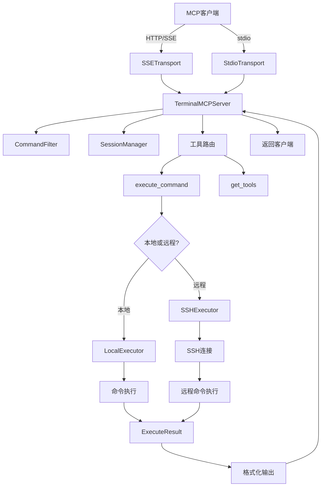

# 项目架构说明

## 📁 项目结构

```
shell-mcp/
├── README.md                 # 项目说明文档
├── LICENSE                   # MIT开源许可证
├── requirements.txt          # Python依赖列表
├── .gitignore               # Git忽略文件配置
├── ARCHITECTURE.md          # 项目架构说明（本文件）
├── config.json              # 配置文件（运行时生成）
├── shell_mcp_server.py      # 主程序文件
├── test_stdio.py            # stdio模式测试脚本
├── test_simple.py           # 简单测试脚本
├── test_manual.py           # 手动测试脚本
└── logs.log                 # 日志文件
```

## 🏗️ 系统架构

### 核心组件

#### 1. TerminalMCPServer (主服务器)

- **位置**: `terminal_mcp_server.py:378-707`
- **职责**:
  - MCP协议处理
  - 工具注册和管理
  - 请求路由和响应
  - 配置管理

#### 2. CommandFilter (命令过滤器)

- **位置**: `terminal_mcp_server.py:95-226`
- **职责**:
  - 命令黑白名单验证
  - 危险命令检测
  - 正则表达式编译和匹配

#### 3. SessionManager (会话管理器)

- **位置**: `terminal_mcp_server.py:228-271`
- **职责**:
  - SSH连接会话管理
  - 会话超时处理
  - 环境变量持久化

#### 4. 执行器模块

##### LocalExecutor (本地执行器)

- **位置**: `terminal_mcp_server.py:345-376`
- **职责**: 本地命令执行和结果返回

##### SSHExecutor (SSH执行器)

- **位置**: `terminal_mcp_server.py:273-343`
- **职责**: 远程SSH连接和命令执行

#### 5. 传输层模块

##### StdioTransport (标准输入输出传输)

- **位置**: `terminal_mcp_server.py:722-780`
- **职责**: 标准输入输出通信

##### SSETransport (HTTP/SSE传输)

- **位置**: `terminal_mcp_server.py:782-1310`
- **职责**: HTTP服务器和Server-Sent Events

### 数据流图



## 🔧 配置系统

### 配置文件层级

1. **默认配置**: 程序内置的默认参数
2. **config.json**: 用户自定义配置文件
3. **环境变量**: 运行时环境变量覆盖
4. **命令行参数**: 启动时参数最高优先级

### 配置项说明

| 配置项              | 类型 | 默认值             | 说明             |
| ------------------- | ---- | ------------------ | ---------------- |
| session_timeout     | int  | 1200               | 会话超时时间(秒) |
| command_filter      | dict | -                  | 命令过滤器配置   |
| ssh.timeout         | int  | 30                 | SSH连接超时时间  |
| ssh.max_connections | int  | 10                 | 最大SSH连接数    |
| logging.level       | str  | "INFO"             | 日志级别         |
| logging.file        | str  | "terminal_mcp.log" | 日志文件路径     |

## 🛡️ 安全机制

### 1. 命令过滤系统

#### 黑名单机制

- 基于正则表达式匹配
- 支持命令开头锚定 (`^`)
- 支持命令内容搜索
- 默认阻止危险系统命令

#### 白名单机制

- 仅允许指定命令执行
- 适合高安全环境
- 可与黑名单组合使用

#### 危险命令检测

- `rm` 删除命令特殊检测
- 要求 `force_execute=true` 确认
- 提供详细风险说明

### 2. 连接安全

#### SSH连接

- 支持密钥和密码认证
- 连接超时保护
- 连接池管理
- 自动重连机制

#### 网络安全

- CORS配置
- 请求大小限制
- 连接频率控制
- 异常连接清理

## 📊 性能优化

### 1. 异步处理

- 基于asyncio事件循环
- 非阻塞I/O操作
- 并发连接支持

### 2. 资源管理

- 连接池复用
- 会话自动清理
- 内存使用优化
- 日志文件轮转

### 3. 缓存策略

- SSH连接复用
- 正则表达式预编译
- 配置文件缓存

## 🔌 MCP协议实现

### 支持的MCP方法

| 方法       | 说明         | 状态 |
| ---------- | ------------ | ---- |
| initialize | 协议初始化   | ✅   |
| tools/list | 工具列表查询 | ✅   |
| tools/call | 工具调用执行 | ✅   |
| ping       | 连接保持     | ✅   |

### 工具定义

#### execute_command

- **功能**: 执行本地或远程命令
- **参数**: command, host, username, password等
- **返回**: stdout, stderr, exit_code, execution_time

#### get_tools

- **功能**: 获取支持的工具列表
- **参数**: 无
- **返回**: 工具描述和参数定义

## 🚀 部署架构

### 单机部署

```
[MCP客户端] <-> [ShellMCPServer] <-> [本地Shell]
```

### 分布式部署

```
[MCP客户端] <-> [ShellMCPServer] <-> [SSH连接] <-> [远程服务器1]
                                      <-> [远程服务器2]
                                      <-> [远程服务器N]
```

### 负载均衡部署

```
[MCP客户端] <-> [负载均衡器] <-> [ShellMCPServer实例1] <-> [目标服务器]
                         <-> [ShellMCPServer实例2] <-> [目标服务器]
```

## 🔍 监控和日志

### 日志级别

- **DEBUG**: 详细调试信息
- **INFO**: 一般信息记录
- **WARNING**: 警告信息
- **ERROR**: 错误信息

### 关键日志点

- 服务器启动/停止
- 配置加载/修改
- 会话创建/销毁
- 命令执行开始/结束
- 安全事件记录
- 连接状态变化

### 性能指标

- 命令执行时间
- 连接建立时间
- 内存使用情况
- 并发连接数
- 错误率统计

## 🧪 测试架构

### 测试类型

- **单元测试**: 各模块功能测试
- **集成测试**: 模块间协作测试
- **安全测试**: 命令过滤和权限测试
- **性能测试**: 并发和负载测试
- **兼容性测试**: 不同平台和Python版本

### 测试工具

#### 内置测试脚本

- **test_stdio.py**: 完整的stdio模式测试，支持自动测试和交互模式
- **test_simple.py**: 简单的管道测试，验证基本功能
- **test_manual.py**: 文件输入测试，适合调试复杂场景

#### 开发测试工具

- **pytest**: 单元测试框架
- **unittest.mock**: 模拟对象
- **coverage**: 代码覆盖率
- **bandit**: 安全漏洞扫描

## 🔄 扩展性设计

### 1. 插件系统

- 支持自定义执行器
- 支持自定义过滤器
- 支持自定义传输层

### 2. 配置扩展

- 支持动态配置更新
- 支持配置文件热加载
- 支持环境变量注入

### 3. 协议扩展

- 支持新MCP协议版本
- 支持自定义工具
- 支持事件通知

## 📈 版本规划

### v1.0 (当前版本)

- ✅ 基础MCP协议支持
- ✅ 本地/远程命令执行
- ✅ 安全命令过滤
- ✅ 会话管理
- ✅ 双传输模式

### v1.1 (计划中)

- 🔄 Web管理界面
- 🔄 更多认证方式
- 🔄 命令执行历史
- 🔄 性能监控面板

### v2.0 (未来版本)

- 📋 集群部署支持
- 📋 分布式会话管理
- 📋 高级安全策略
- 📋 插件生态系统

---

**注意**: 本架构文档会随着项目发展持续更新，请关注最新版本。
